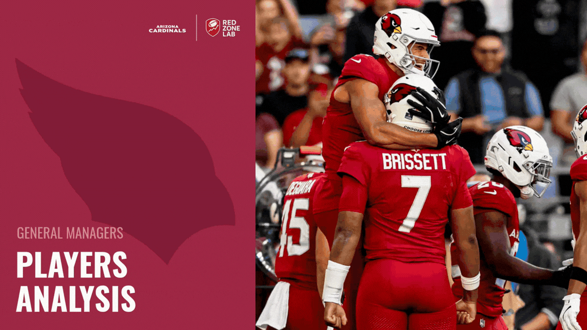
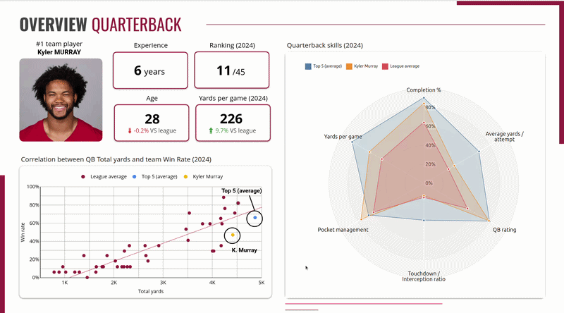
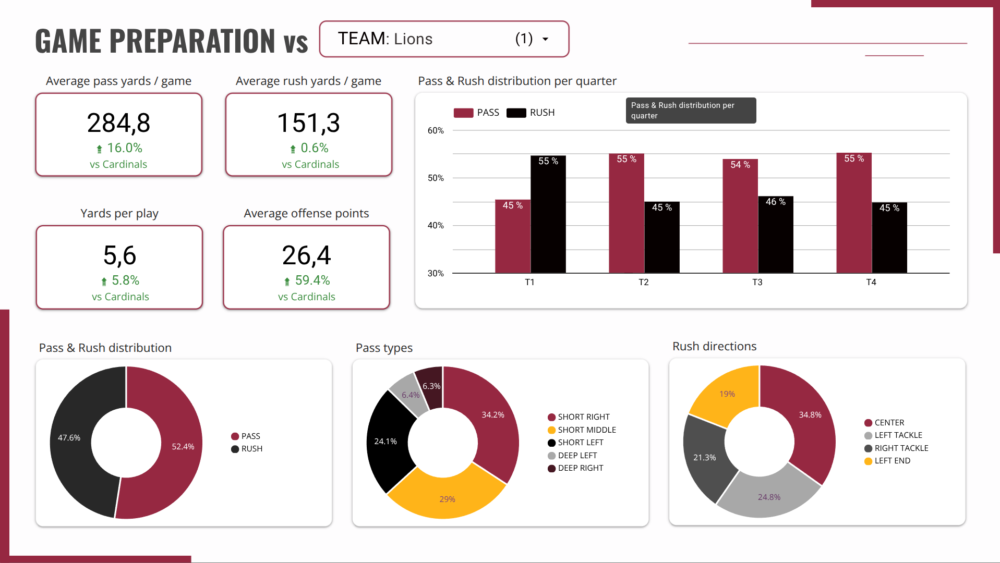
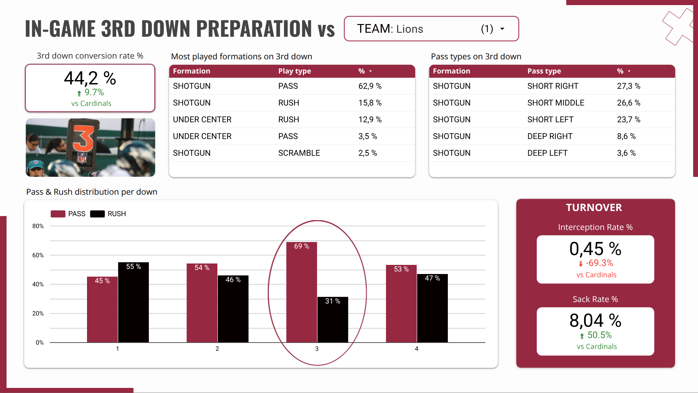
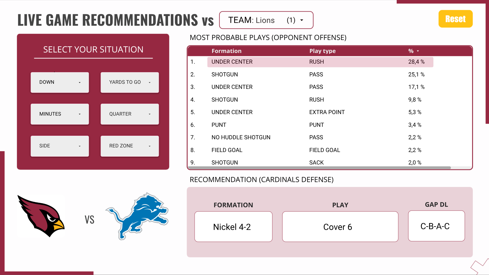

<div align="center">

🇫🇷 **[Version française](#version-française)** · 🇬🇧 **[English version](#english-version)**

</div>

---

<p align="center">
  
  
  
  
</p>

<div align="center">

🇫🇷 **Version française**

</div>

<a id="version-française"></a>

# 🏈 Saison NFL 2024 : Analyse des Arizona Cardinals

<p align="center">
  <strong>Transformer la donnée NFL en décisions : classements de joueurs, tendances d'adversaires et plans défensifs contextualisés.</strong>
</p>

<p align="center">
  
</p>

<p align="center">
  <a href="https://datastudio.google.com/reporting/9e5cad15-af7e-4057-ac06-7f198721c7d3">🔗 Tableau de bord interactif</a>
</p>

## 🎯 Contexte & objectif

En 2024, les **Arizona Cardinals** souhaitaient exploiter la donnée pour améliorer à la fois la **gestion de l'effectif** et la **stratégie de jeu**.

Réalisé par une **équipe de 4 personnes en 10 jours**, ce projet de fin d'études exploite des données joueurs, équipes et play-by-play pour :
- **Benchmarking des joueurs** et décisions liées à l'effectif.
- **Préparation des matchs** et stratégie de jeu.
- **Aide à la décision défensive en cours de match**.

Stack : **BigQuery, SQL, dbt et Looker Studio**.

## ⚡ Résultats et recommandations métier

- **Gestion de l'effectif** : benchmarker les joueurs par poste et anticiper les besoins de succession.
- **Stratégie offensive** : comparer l'utilisation des formations à leur efficacité pour identifier des opportunités.
- **Préparation défensive** : se concentrer sur les situations à fort impact et les tendances récurrentes des adversaires.
- **Décisions en cours de match** : utiliser les comportements historiques dans des situations comparables comme input défensif complémentaire.

| Insight clé | Décision associée |
|---|---|
| **Kyler Murray se classe 11e parmi les 45 QB ayant au moins 3 titularisations**, sur sa production combinée à la passe et à la course, avec **226 yards à la passe par match**. Sa gestion de la pocket est un point fort, tandis que le **ratio TD/interceptions reste un point faible**. | **Prioriser la réduction des interceptions** tout en conservant sa bonne gestion de la pocket, afin de le rapprocher du profil d'un quarterback de premier plan. |
| **James Conner a enregistré 94 yards totaux par match (course + passe)**, au-dessus de la moyenne de la ligue. À **30 ans**, la préparation de sa succession devient un enjeu important pour l'effectif. | **Anticiper sa succession** en identifiant et développant un RB plus jeune tout en maintenant le niveau de production actuel de Conner. |
| **Kyzir White affiche une efficacité au plaquage d'environ +13,5 % par rapport à la moyenne de la ligue**. | **Prioriser le maintien de Kyzir White comme contributeur défensif clé compte tenu de son efficacité au plaquage supérieure à la moyenne.** |
| **Les formations utilisées sur les courses sont plus équilibrées**, mais les courses au centre sont les plus fréquentes alors qu'elles ne figurent pas parmi les **6 combinaisons les plus efficaces**. | **Favoriser les courses sur les côtés lorsque la situation le permet** afin de rechercher davantage de yards par tentative et de réduire la dépendance aux courses centrales les plus utilisées. |
| Sur **3e tentative, le taux d'interception des Lions n'est que de 0,45 %**, mais **8 % des tentatives se terminent par un sack**. | **Augmenter l'utilisation du blitz sur 3e tentative** lorsque la situation le permet, en ciblant une ligne offensive qui montre une vulnérabilité à la pression. |

## 🧰 Stack technique

| Catégorie | Technologie | Rôle |
|---|---|---|
| Entrepôt de données | **Google BigQuery** | Environnement d'analyse des données |
| Transformation | **dbt** | Transformation SQL et modélisation des données |
| Langage de requête | **SQL** | Nettoyage, jointures, agrégations, KPIs et classements |
| BI / visualisation | **Looker Studio** | Tableaux de bord interactifs |
| Préparation des données | **Google Sheets** | Préparation et nettoyage initiaux |
| Contrôle de version | **Git / GitHub** | Gestion du code source et documentation du projet |

## 🛠️ Approche analytique

1. **Préparer les données** : Nettoyer et standardiser les données d'équipes, de joueurs et de play-by-play dans dbt.
2. **Transformer et modéliser** : Construire la **modélisation des données** via les modèles dbt pour les matchs, les actions et les joueurs, avec jointures, KPIs, classements et normalisation des données.
3. **Comparer les joueurs** : Comparer les joueurs des Cardinals aux joueurs de la ligue à l'aide de KPIs spécifiques à différentes positions (QB, RB, WR et LB).
4. **Analyser les situations de jeu** : Identifier les tendances des adversaires selon la formation, le type d'action, la tentative, la distance et le contexte du match.
5. **Produire les analyses** : Analyser les résultats et créer des recommendations sur l'effectif, la préparation des matchs et les recommandations en cours de match.

## 🏗️ Architecture dbt

Le projet s'appuie sur une **architecture en médaillon** (*medallion*), qui organise la **modélisation des données** en couches successives, des données brutes jusqu'à la restitution. Chaque couche affine la précédente : les données sont d'abord **collectées et standardisées**, puis **modélisées et enrichies** (jointures, classements, KPIs), enfin **agrégées** pour le pilotage.

Le dépôt contient **34 modèles SQL**, répartis sur les trois couches de l'architecture en médaillon :

| Couche en médaillon | Couche dbt | Modèles | Rôle |
|---|---|---|---|
| 🥉 **Bronze** | `staging` | **9** | Collecte et standardisation des sources brutes |
| 🥈 **Argent** | `intermediate` | **21** | Modélisation des données : nettoyage, jointures, agrégations, classements et KPIs |
| 🥇 **Or** | `mart` | **4** | Agrégats de restitution par position (QB, RB, WR, LB) |

```text
SOURCES BRUTES
                    │
                    ▼
┌─────────────────────────────────────┐
│ BRONZE · PRÉPARATION : 9 modèles    │
│                                     │
│ Renommage / standardisation         │
└──────────────────┬──────────────────┘
                    │
                    ▼
┌─────────────────────────────────────┐
│ ARGENT · INTERMÉDIAIRE : 21 modèles │
│                                     │
│ Matchs et actions                   │
│ Nettoyage des joueurs               │
│ Jointures et agrégations            │
│ Classements                         │
│ Calcul des KPIs                     │
│ Mise à l'échelle / comparaison      │
└──────────────────┬──────────────────┘
                    │
                    ▼
┌─────────────────────────────────────┐
│ OR · RESTITUTION : 4 modèles        │
│                                     │
│ Quarterbacks                        │
│ Running backs                       │
│ Receveurs                           │
│ Linebackers                         │
└──────────────────┬──────────────────┘
                    │
                    ▼
            LOOKER STUDIO
                    │
                    ▼
   ANALYSE ET AIDE À LA DÉCISION
```

## 📊 Benchmarking des joueurs

> **Où se situe un joueur des Cardinals par rapport aux autres joueurs de la ligue à son poste ?**  
> **Quelles sont les forces et faiblesses de chaque joueur ?**

Les modèles joueurs utilisent des window functions telles que `ROW_NUMBER()`, `MIN()` et `MAX()` pour construire les classements et les indicateurs normalisés.

Par exemple, les modèles de quarterbacks :

- filtrer les QB ayant au moins **3 titularisations** (pour avoir suffisamment de données) ;
- classer les joueurs selon leur production combinée à la passe et à la course ;
- identifier isolément Kyler Murray (Cardinals) ;
- identifier un groupe de référence composé du Top 5 de la ligue ;
- normaliser les indicateurs de performance entre les valeurs minimales et maximales observées.

Le même principe est adapté aux différents postes avec des KPIs différents (QB, RB, WR et LB).

<p align="center">
  
</p>

## 🧠 Préparation des matchs

La préparation des matchs transforme les données historiques des adversaires en **éléments concrets pour préparer le plan de jeu défensif**.

L'analyse permet notamment de :
- **Mesurer la production offensive** : yards à la passe, yards à la course et points marqués.
- **Identifier les tendances** : évolution par quart-temps, formations et types d'actions.
- **Analyser les 3e tentatives** : taux de conversion et combinaisons les plus fréquentes.
- **Repérer les vulnérabilités** : par exemple, une fréquence élevée de sacks pouvant indiquer une opportunité de mettre davantage de pression.

### Exemple : préparation face aux Detroit Lions

Les Lions présentent une production importante à la passe et à la course, ainsi qu'un niveau de scoring supérieur à celui des Cardinals. Sur **3e tentative**, ils montrent notamment une forte tendance **Shotgun + Pass**, avec un faible taux d'interception mais une part notable d'actions se terminant par un sack.

L'objectif est de transformer ces tendances en **préparation ciblée**, en identifiant les situations à surveiller et les leviers tactiques à privilégier.

<p align="center">
  
</p>

<p align="center">
  
</p>

## 🎯 Aide à la décision en cours de match

Un tableau de bord interactif permet de s'adapter à toute situation de jeu en identifiant les stratégies offensives adverses les plus probables, afin d'aider la défense à prendre les meilleures décisions. L'objectif n'est pas de prédire avec certitude l'action suivante, mais de fournir un **élément d'aide à la décision fondé sur les données**.

Par exemple, sur une **3e & 6 dans le camp adverse**, une forte tendance **Shotgun + Pass** peut soutenir une recommandation telle que **Nickel 4-2 / Cover 6**.

<p align="center">
  
</p>

## 👤 Ma contribution

J'ai piloté le projet et étais principalement responsable de l'**analyse des données et des joueurs**.

- **Collecte & infrastructure de données** : collecte des données, mise en place sur **GCP / BigQuery** et configuration de **dbt**.
- **Pipeline joueurs** : nettoyage, transformations, jointures et calcul des KPIs pour l'ensemble des données du roster.
- **Analyse & dashboards joueurs** : conception des analyses, dashboards et mise en page associés au roster des Cardinals.
- **Dashboards & restitution** : contribution aux autres dashboards du projet, au storytelling global et à la présentation orale finale.
- **Pilotage** : coordination de la répartition des tâches au sein de l'équipe.

## 📁 Structure du repository

```text
2024-NFL-season-data-analysis/
│
├── analyses/                            # vide
├── assets/
│   ├── game-preparation-3rd-down.png
│   ├── game-preparation.png
│   ├── live-recommendations.png
│   └── quarterback-analysis.gif
│
├── models/
│   ├── staging/
│   │   ├── nfl/
│   │   └── ...
│   │
│   ├── intermediate/
│   │   ├── games_and_plays/
│   │   ├── players/
│   │   └── ...
│   │
│   └── mart/
│
├── macros/                              # vide
├── seeds/                               # vide
├── snapshots/                           # vide
├── tests/                               # vide
│
├── dbt_project.yml
├── schema.yml
├── Pitch.md
├── .gitignore
└── README.md
```

## ⚠️ Limites & prochaines étapes possibles

Le projet a été développé en **10 jours**, plusieurs améliorations de niveau production restent donc à mettre en place :

- Ajouter des tests dbt automatisés et un suivi de la qualité des données.
- Ajouter des macros dbt réutilisables et une documentation plus complète des modèles.
- Enrichir la couche de recommandations avec des **modèles prédictifs / probabilistes** et du backtesting.

## 📊 Tableau de bord interactif

Le tableau de bord complet est disponible ici :

<p align="center">
  <a href="https://datastudio.google.com/reporting/9e5cad15-af7e-4057-ac06-7f198721c7d3">
    <strong>🔗 Ouvrir le tableau de bord Looker Studio</strong>
  </a>
</p>

## 👋 À propos de moi

Je suis **Data Analyst & Analytics Engineer**.

Après 5 ans dans la gestion de projets, j'ai choisi d'orienter ma carrière vers la Data et de développer mes compétences en analyse, modélisation et ingénierie des données.

J'apprécie autant l'exploration des données pour répondre aux problématiques métier que la construction de bases fiables facilitant leur utilisation.

Vous pouvez retrouver d'autres projets dans mon **[Portfolio](https://github.com/Mathias-Ramos/Portfolio)**.

<p>
  <a href="https://www.linkedin.com/in/mathias-ramos">LinkedIn</a> •
  <a href="mailto:mathias.ramos@outlook.fr">Email</a>
</p>

---

<div align="center">

🇬🇧 **English version**

</div>

<a id="english-version"></a>

# 🏈 2024 NFL Season - Arizona Cardinals Data Analysis

<p align="center">
  <strong>Turning NFL data into decisions: player rankings, opponent tendencies and contextualized defensive plans.</strong>
</p>

<p align="center">
  
</p>

<p align="center">
  <a href="https://datastudio.google.com/reporting/9e5cad15-af7e-4057-ac06-7f198721c7d3">🔗 Interactive dashboard</a>
</p>

## 🎯 Context & objective

In 2024, the **Arizona Cardinals** wanted to leverage data to improve both **roster management** and **game strategy**.

Developed by a **4-person team over 10 days**, the project uses player, team and play-by-play data to support:
- **Player benchmarking** and roster decisions.
- **Opponent preparation** and game strategy.
- **In-game defensive decision support**.

Stack: **BigQuery, SQL, dbt and Looker Studio**.

## ⚡ Key results and business recommendations

- **Roster management**: Benchmark players by position and anticipate succession needs.
- **Offensive strategy**: Compare formation usage with efficiency to identify strategic opportunities.
- **Defensive preparation**: Focus on high-leverage situations and recurring opponent tendencies.
- **In-game decisions**: Use historical behavior in comparable situations as an additional defensive input.

| Key insight | Decision use |
|---|---|
| **Kyler Murray ranked 11th among the 45 QBs with at least 3 starts**, based on combined passing and rushing production, with **226 passing yards/game**. Strong pocket management stands out, while the **TD/INT ratio remains a weakness**. | **Prioritize reducing interceptions** while preserving his pocket management, with the objective of moving him toward a top-tier QB profile. |
| **James Conner averaged 94 total yards per game (rushing + receiving)**, above league average. At **30 years old**, succession planning becomes a key roster consideration. | **Start planning for his succession** by identifying and developing a younger RB option while maintaining Conner's current production. |
| **Kyzir White showed tackling efficiency around +13.5% vs league average**. | **Prioritize retaining Kyzir White as a key defensive contributor based on his above-average tackling efficiency.** |
| **Running formations are more balanced**, but central runs are the most frequent despite not appearing among the **6 most efficient combinations**. | **Favor outside runs when the situation allows** to seek higher yards per attempt and reduce reliance on the most-used central runs. |
| On **3rd down, the Lions' interception rate is only 0.45%**, but **8% of attempts end in a sack**. | **Increase blitz usage on 3rd down** when the situation allows, targeting an offensive line that shows vulnerability to pressure. |

## 🧰 Tech stack

| Category | Technology | Role |
|---|---|---|
| Data warehouse | **Google BigQuery** | Analytical data environment |
| Transformation | **dbt** | SQL transformation and data modeling |
| Query language | **SQL** | Cleaning, joins, aggregations, KPIs and rankings |
| BI / visualization | **Looker Studio** | Interactive dashboards |
| Data preparation | **Google Sheets** | Initial preparation / cleaning |
| Version control | **Git / GitHub** | Source control and project documentation |

## 🛠️ Analytical approach

1. **Prepare the data**: Clean and standardize team, player and play-by-play data in dbt.
2. **Transform & model**: Build the **data modeling** layer through dbt models for games, plays and players, including joins, KPIs, rankings and normalization.
3. **Benchmark players**: Compare Cardinals players with NFL benchmarks using position-specific KPIs for QB, RB, WR and LB.
4. **Analyze game situations**: Identify opponent tendencies by formation, play type, down, distance and game context.
5. **Deliver insights**: Analyze the results and create recommendations for roster management, opponent preparation and in-game decision support.

## 🏗️ dbt architecture

The project follows a **medallion architecture**, which organizes **data modeling** into successive layers, from raw data all the way to reporting. Each layer refines the previous one: data is first **collected and standardized**, then **modeled and enriched** (joins, rankings, KPIs), and finally **aggregated** for decision-making.

The repository contains **34 SQL models**, spread across the three layers of the medallion architecture:

| Medallion layer | dbt layer | Models | Role |
|---|---|---|---|
| 🥉 **Bronze** | `staging` | **9** | Raw source collection and standardization |
| 🥈 **Silver** | `intermediate` | **21** | Data modeling: cleaning, joins, aggregations, rankings and KPIs |
| 🥇 **Gold** | `mart` | **4** | Reporting aggregates by position (QB, RB, WR, LB) |

```text
RAW SOURCES
                    │
                    ▼
┌─────────────────────────────────────┐
│ BRONZE · STAGING: 9 models          │
│                                     │
│ Rename / standardize / prepare      │
└──────────────────┬──────────────────┘
                    │
                    ▼
┌─────────────────────────────────────┐
│ SILVER · INTERMEDIATE: 21 models    │
│                                     │
│ Games & plays                       │
│ Player cleaning                     │
│ Joins & aggregations                │
│ Rankings                            │
│ KPI calculations                    │
│ Scaling / benchmarking              │
└──────────────────┬──────────────────┘
                    │
                    ▼
┌─────────────────────────────────────┐
│ GOLD · MART: 4 models               │
│                                     │
│ Quarterbacks                        │
│ Running backs                       │
│ Wide receivers                      │
│ Linebackers                         │
└──────────────────┬──────────────────┘
                    │
                    ▼
            LOOKER STUDIO
                    │
                    ▼
      ANALYSIS & DECISION SUPPORT
```

## 📊 Player benchmarking

> **Where does a Cardinals player stand relative to comparable NFL players?**  
> **What are each player's strengths and weaknesses?**

The player models use window functions such as `ROW_NUMBER()`, `MIN()` and `MAX()` to build rankings and normalized metrics.

For example, quarterback models:

- filter to QBs with at least **3 starts**;
- rank players by combined passing/rushing production;
- identify Cardinals' Kyler Murray separately;
- identify a Top 5 benchmark group;
- normalize performance metrics between observed minimum and maximum values.

The same pattern is adapted to running backs, wide receivers and linebackers with different KPIs.

<p align="center">
  
</p>

## 🧠 Opponent preparation

Opponent preparation turns historical opponent data into **concrete inputs for the defensive game plan**.

The analysis focuses on:
- **Offensive production**: passing yards, rushing yards and points scored.
- **Key tendencies**: quarter-by-quarter behavior, formations and play types.
- **Third-down situations**: conversion rates and most frequent combinations.
- **Potential vulnerabilities**: for example, a high sack rate may indicate an opportunity to increase pressure.

### Example: preparing for the Detroit Lions

The Lions show significant passing and rushing production, together with a scoring level above the Cardinals'. On **3rd down**, they show a strong **Shotgun + Pass** tendency, with a low interception rate but a meaningful share of plays ending in a sack.

The goal is to turn these tendencies into **targeted game preparation**, identifying key situations to monitor and tactical levers to prioritize.

<p align="center">
  
</p>

<p align="center">
  
</p>

## 🎯 In-game decision support

An interactive dashboard adapts to any game situation by identifying the most likely opponent offensive strategies and helping the defense make better decisions. The goal is not to predict the next play with certainty, but to provide a **data-driven input for in-game decisions**.

For example, on **3rd & 6 in opponent territory**, a strong **Shotgun + Pass** tendency can support a recommendation such as **Nickel 4-2 / Cover 6**.

<p align="center">
  
</p>

## 👤 My contribution

I led the project and was primarily responsible for **data and player analysis**.

- **Data collection & infrastructure**: data collection, deployment on **GCP / BigQuery**, and configuration of **dbt**.
- **Player pipeline**: data cleaning, transformations, joins, and calculation of KPIs for the entire roster dataset.
- **Player analysis & dashboards**: Designing analyses, dashboards, and layouts related to the Cardinals’ roster.
- **Dashboards & reporting**: Contributing to other project dashboards, the overall storytelling, and the final oral presentation.
- **Project management**: Coordinating the distribution of tasks within the team.

## 📁 Repository structure

```text
2024-NFL-season-data-analysis/
│
├── analyses/                            # empty
├── assets/
│   ├── game-preparation-3rd-down.png
│   ├── game-preparation.png
│   ├── live-recommendations.png
│   └── quarterback-analysis.gif
│
├── models/
│   ├── staging/
│   │   ├── nfl/
│   │   └── ...
│   │
│   ├── intermediate/
│   │   ├── games_and_plays/
│   │   ├── players/
│   │   └── ...
│   │
│   └── mart/
│
├── macros/                              # empty
├── seeds/                               # empty
├── snapshots/                           # empty
├── tests/                               # empty
│
├── dbt_project.yml
├── schema.yml
├── Pitch.md
├── .gitignore
└── README.md
```

## ⚠️ Limitations & next steps

The project was developed in **10 days**, so several production-grade improvements remain:

- Add automated dbt tests and data-quality monitoring.
- Add reusable dbt macros and richer model documentation.
- Extend the recommendation layer with **predictive / probabilistic models** and backtesting.

## 📊 Interactive dashboard

The complete dashboard is available here:

<p align="center">
  <a href="https://datastudio.google.com/reporting/9e5cad15-af7e-4057-ac06-7f198721c7d3">
    <strong>🔗 Open the Looker Studio dashboard</strong>
  </a>
</p>

## 👋 About me

I am a **Data Analyst & Analytics Engineer**.

After 5 years managing projects, I chose to evolve my career toward Data and develop my skills in analytics, data modeling and data engineering.

I enjoy both exploring data to answer business questions and building reliable foundations that make data easier to use.

More projects are available in my **[Portfolio](https://github.com/Mathias-Ramos/Portfolio)**.

<p>
  <a href="https://www.linkedin.com/in/mathias-ramos">LinkedIn</a> •
  <a href="mailto:mathias.ramos@outlook.fr">Email</a>
</p>
