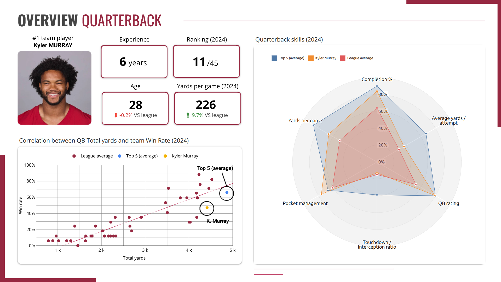

# 🏈 2024 NFL Season — Arizona Cardinals Data Analysis

[](#)
[](#)
[](#)
[](#)

> **Turning NFL data into actionable insights for roster management, opponent analysis and in-game strategy.**

<p align="center">
  
</p>

---

## 📌 Overview

The **2024 NFL Season Data Analysis** project was developed to explore how data could support the **Arizona Cardinals** in improving both roster management and game strategy.

The project combines player-level performance analysis with team and play-by-play data to answer two main questions:

1. **How can the Cardinals evaluate and optimize their roster?**
2. **How can data help coaches prepare for and react to specific game situations?**

The final solution combines a **BigQuery data warehouse**, **SQL transformations with dbt**, and **Looker Studio dashboards** to turn raw NFL data into decision-oriented insights.

### Project scope

- **Duration:** 10 days
- **Team:** 4 people
- **Season analyzed:** 2024 NFL regular season
- **Main focus:** Arizona Cardinals
- **Output:** Interactive analytical dashboards and situational game recommendations

---

## 🎯 Business Questions

### 1. Roster & Player Analytics

How do Cardinals players compare with the rest of the NFL at their position?

The analysis focuses on:

- Player rankings
- Performance against league averages
- Position-specific KPIs
- Player age and experience
- Strengths and weaknesses
- Potential roster succession needs

### 2. Game Strategy

Which offensive formations and play combinations are the most frequently used and the most efficient?

The analysis compares:

- Pass vs. rush
- Shotgun vs. Under Center
- Pass types
- Rush directions
- Yards per play
- Situational tendencies

### 3. Opponent Preparation

How can historical data help the Cardinals identify an opponent's tendencies before a game?

The analysis can be used to investigate:

- Offensive tendencies by quarter
- Pass/rush distribution
- Formation preferences
- Pass types
- Rush directions
- Third-down behavior
- Turnover and sack rates

### 4. In-Game Decision Support

Can the same data be used to provide a tactical recommendation based on the current game situation?

The final dashboard allows the user to define a situation using:

- Down
- Yards to go
- Quarter
- Minutes remaining
- Field position
- Red zone situation

The tool then identifies the opponent's most probable plays and provides a defensive recommendation.

---

# 📊 Key Insights

## 1. Player Analytics

### Quarterback — Kyler Murray

Kyler Murray ranked **11th out of 45 quarterbacks** in the 2024 analysis, with **226 passing yards per game**, approximately **9.7% above the league average**.

The analysis also highlights a strong pocket-management profile, while identifying a weaker touchdown/interception ratio compared with the top-performing quarterbacks.

<p align="center">
  
</p>

### Running Back — James Conner

James Conner was one of the Cardinals' most productive players, averaging **94 rushing yards per game**, above the league average.

However, his **30-year-old age** introduces a roster-planning consideration: performance remains high, but succession planning becomes increasingly relevant.

### Linebacker — Kyzir White

The same analytical framework can be applied to defensive positions.

Kyzir White was identified among the stronger linebackers in the league, with tackling efficiency approximately **13.5% above the league average**.

This position-based approach allows the framework to be extended to different player profiles and roster decisions.

---

# 2. Game Strategy

One of the main findings is that the most frequently used formation is not necessarily the most efficient.

For passing plays, the NFL shows a strong preference for the **Shotgun** formation. However, some **Under Center** combinations can generate higher average yards per attempt despite being used less frequently.

This creates a potential strategic opportunity:

> **A less frequently used formation can sometimes provide higher offensive efficiency.**

The same reasoning applies to rushing plays, where central runs are frequently used even though some outside directions can generate higher average gains.

---

# 3. Opponent Analysis — Detroit Lions

For the opponent preparation use case, the dashboard was applied to the **Detroit Lions**.

The Lions' 2024 profile showed:

- **284.8 passing yards/game**
- **151.3 rushing yards/game**
- **26.4 offensive points/game**
- Passing production approximately **16% above the Cardinals**
- Offensive scoring approximately **59.4% above the Cardinals**

Their offensive behavior also changes throughout the game, with a stronger reliance on rushing during the first quarter and a greater emphasis on passing later in the game.

<p align="center">
  
</p>

---

# 4. Third-Down Analysis

Third down represents a particularly valuable situation for defensive preparation.

Against the Lions, the analysis shows:

- **44.2% third-down conversion rate**
- **62.9% Shotgun + Pass** as their most common third-down combination
- A strong preference for short passes
- **0.45% interception rate**
- **8.04% sack rate**

The third-down analysis therefore provides the coaching staff with a more precise view of how the opponent behaves in a high-leverage situation.

<p align="center">
  
</p>

---

# 5. In-Game Tactical Recommendations

The final dashboard translates historical tendencies into a situational decision-support tool.

For example, in a situation against the Lions, the tool identifies the opponent's most probable plays and provides a corresponding defensive recommendation.

In the illustrated scenario, the recommendation is:

| Defensive decision | Recommendation |
|---|---|
| **Formation** | Nickel 4-2 |
| **Coverage / Play** | Cover 6 |
| **Defensive Line Gap Assignment** | C-B-A-C |

The objective is not to predict the exact next play, but to provide a **data-driven recommendation based on historically observed tendencies under similar game conditions**.

<p align="center">
  
</p>

---

# 🧰 Tech Stack

| Technology | Usage |
|---|---|
| **SQL** | Data cleaning, transformation and analytical queries |
| **Google BigQuery** | Data warehouse and analytical environment |
| **dbt** | Data transformation and analytical data modeling |
| **Looker Studio** | Interactive dashboards and reporting |
| **Google Sheets** | Initial data preparation / cleaning |
| **Git / GitHub** | Version control and project documentation |

---

# 🗂️ Data Sources

The project combines several NFL datasets:

### NFL Team Statistics

**NFL Team Stats 2002 – Feb. 2025 (ESPN)**

Used for historical team-level analysis and league comparisons.

### NFL Play-by-Play Data

**NFL Play by Play Game Stats 2024**

Used for game-level and play-level analysis, including:

- Downs
- Distance
- Formation
- Play type
- Pass type
- Rush direction
- Quarter
- Game situation

### Pro Football Reference

Multiple datasets were used for player-level offensive and defensive performance analysis.

These datasets supported the creation of position-specific benchmarks and rankings for:

- Quarterbacks
- Running backs
- Wide receivers
- Linebackers

> Raw datasets are intentionally not included in this repository. The repository focuses on the transformation logic, analytical methodology and SQL/dbt implementation.

---

# 🔄 Data Architecture

The project uses a layered dbt architecture to separate raw data preparation, transformations and analytical outputs.

```text
                    RAW DATA
                       │
                       ▼
              ┌─────────────────┐
              │     STAGING     │
              │                 │
              │ Cleaning        │
              │ Data typing     │
              │ Standardization │
              └────────┬────────┘
                       │
                       ▼
              ┌─────────────────┐
              │   INTERMEDIATE  │
              │                 │
              │ Joins           │
              │ Aggregations    │
              │ Calculations    │
              │ Scaling         │
              └────────┬────────┘
                       │
                       ▼
              ┌─────────────────┐
              │      MARTS      │
              │                 │
              │ QB              │
              │ RB              │
              │ WR              │
              │ LB              │
              └────────┬────────┘
                       │
                       ▼
                LOOKER STUDIO
                       │
                       ▼
             BUSINESS INSIGHTS
                       │
                       ▼
              TACTICAL ACTIONS
```

### Staging

The staging layer prepares source datasets by:

- Cleaning raw fields
- Standardizing column names
- Converting data types
- Preparing datasets for downstream transformations

### Intermediate

The intermediate layer contains the main analytical transformations:

- Complex joins
- Aggregations
- Player performance calculations
- Situational statistics
- League comparisons
- Scaled metrics

### Marts

The mart layer produces analysis-ready datasets for the dashboards.

The repository contains dedicated analytical models for:

```text
models/
├── staging/
│   └── nfl/
│
├── intermediate/
│   ├── games_and_plays/
│   └── players/
│
└── mart/
    ├── quarterbacks
    ├── runningbacks
    ├── wide_receivers
    └── linebackers
```

---

# 📁 Repository Structure

```text
2024-NFL-season-data-analysis/
│
├── analyses/
│
├── models/
│   ├── staging/
│   │   └── nfl/
│   │
│   ├── intermediate/
│   │   ├── games_and_plays/
│   │   └── players/
│   │
│   └── mart/
│
├── macros/
├── seeds/
├── snapshots/
├── tests/
│
├── dbt_project.yml
├── schema.yml
├── .gitignore
└── README.md
```

---

# 🔍 Methodology

The analytical process followed four main steps:

### 1. Data preparation

Multiple NFL datasets were collected and prepared for analysis.

### 2. Data transformation

SQL transformations were developed in dbt to clean, standardize and combine the datasets.

### 3. KPI design

Position-specific KPIs were designed to allow players to be compared with league benchmarks.

Examples include:

- Yards per game
- Completion rate
- Average yards per attempt
- QB rating
- Touchdown / interception ratio
- Pocket management
- Tackling efficiency

### 4. Visualization & decision support

The transformed datasets were connected to Looker Studio to create dashboards designed around specific business questions rather than simply displaying raw statistics.

---

# 💡 Business Recommendations

Based on the analyses, several recommendations were identified.

### Roster Management

Use league benchmarks to identify:

- High-performing players
- Underperforming players
- Players whose age creates future succession needs
- Positions requiring additional recruitment attention

### Offensive Strategy

Consider using less frequent but potentially more efficient formation/play combinations when the game situation allows it.

### Defensive Preparation

Against opponents such as the Lions, focus preparation on high-leverage situations such as third down, where formation and play tendencies become particularly informative.

### In-Game Decision Support

Use the opponent's historical behavior under comparable game situations to support defensive play selection.

---

# 👤 My Contribution

This was a **4-person project**, developed over approximately **10 days**.

I was responsible for the data and player-analysis work and also led the overall project.

### Data & Analytics

- Designed and implemented data cleaning and transformation workflows in **SQL/dbt**
- Worked with **Google BigQuery**
- Built the player-related transformation pipeline
- Designed player performance KPIs
- Developed league comparison logic
- Contributed to player analytics for quarterbacks, running backs, wide receivers and linebackers
- Built the analytical datasets consumed by the dashboards

### Data Architecture

- Contributed to the setup of the BigQuery and dbt environment
- Designed the layered data architecture
- Structured transformations into **Staging → Intermediate → Mart** layers

### Data Visualization

- Contributed to the Looker Studio dashboards
- Defined the overall presentation structure
- Designed the narrative and organization of the dashboards
- Worked on dashboard formatting and visual consistency

### Project Leadership

- Led the project throughout the 10-day development period
- Contributed to the selection of the project topic
- Identified relevant datasets
- Coordinated task allocation within the team
- Helped structure the final analytical story

### Presentation

- Co-presented the project during a **15-minute presentation**
- Presented the analytical findings and the decision-support use case

---

# 📊 Interactive Dashboard

The complete set of dashboards is available through the public **Looker Studio** report.

> **[View the interactive dashboard](https://datastudio.google.com/reporting/9e5cad15-af7e-4057-ac06-7f198721c7d3)**

The report includes:

- Team analysis
- Player analytics
- Quarterback analysis
- Running back analysis
- Linebacker analysis
- Game strategy
- Opponent preparation
- Third-down analysis
- In-game recommendations

---

# ⚠️ Limitations & Future Improvements

This project was developed as a **10-day team project**, so several improvements could be implemented in a production-grade version.

### Data quality testing

The dbt project does not currently include automated data tests.

A future version could introduce:

- `not_null` tests
- `unique` tests
- Relationship tests
- Accepted-value tests
- Data freshness checks

### Predictive modeling

The current recommendation is based on historical tendencies and contextual analysis.

A future version could investigate:

- Classification models for play-type prediction
- Probability-based play recommendations
- Expected yards models
- Expected points added (EPA)
- Win probability
- Model evaluation and backtesting

---

# 📬 Contact

**Mathias Ramos**

- LinkedIn: [Mathias Ramos](https://www.linkedin.com/in/mathiasramos/)
- GitHub: [Mathias-Ramos](https://github.com/Mathias-Ramos)